# Test Automation Framework
### Enterprise-Grade Quality Assurance for Modern Web Applications

---

## Executive Summary

This test automation framework delivers **fast, reliable, and maintainable** end-to-end testing for web applications. Built on Microsoft's Playwright with TypeScript, it combines industry best practices with modern tooling to reduce testing costs while increasing coverage and confidence.

### Key Metrics

| Metric | Value |
|--------|-------|
| Test Execution Time | ~10 seconds (25 tests, parallel) |
| Browser Coverage | Chrome, Firefox, Safari |
| Code Coverage Approach | Data-driven (add tests without code changes) |
| Maintenance Overhead | Low (centralized selectors, typed configs) |

---

## Architecture Overview


---

## Core Design Principles

### 1. Data-Driven Testing

Tests are defined in JSON, not code. This means **QA engineers can add test cases without touching TypeScript**.

```mermaid
flowchart LR
    subgraph Input["Test Definition"]
        JSON["test-cases.json<br/>━━━━━━━━━━━━━━<br/>TC001: Verify login<br/>TC002: Verify cart<br/>TC003: Verify checkout"]
    end

    subgraph Engine["Test Engine"]
        Loop["For each test case:<br/>1. Navigate<br/>2. Verify<br/>3. Assert"]
    end

    subgraph Output["Results"]
        Results["✓ TC001 Pass<br/>✓ TC002 Pass<br/>✗ TC003 Fail"]
    end

    JSON --> Loop --> Results

    style Input fill:#c8e6c9
    style Engine fill:#fff9c4
    style Output fill:#ffcdd2
```



**Adding a new test is as simple as:**

```json
{
  "id": "TC007",
  "name": "Verify checkout flow",
  "project": "E-Commerce",
  "taskName": "Complete purchase",
  "expectedColumn": "Done",
  "expectedTags": ["Critical", "Regression"]
}
```

No code changes. No deployments. Just data.

---

### 2. Page Object Model (POM)

UI interactions are **encapsulated** in reusable page objects. When the UI changes, updates happen in one place.

```mermaid
flowchart TB
    subgraph Tests["Test Files"]
        Test1["Login Test"]
        Test2["Checkout Test"]
        Test3["Profile Test"]
    end

    subgraph PageObjects["Page Objects"]
        LoginPage["LoginPage<br/>━━━━━━━━━━<br/>login()<br/>logout()<br/>verifyLoggedIn()"]
        CartPage["CartPage<br/>━━━━━━━━━━<br/>addItem()<br/>removeItem()<br/>checkout()"]
        ProfilePage["ProfilePage<br/>━━━━━━━━━━<br/>updateName()<br/>changePassword()"]
    end

    subgraph App["Application"]
        UI["Web Application UI"]
    end

    Test1 --> LoginPage
    Test2 --> LoginPage
    Test2 --> CartPage
    Test3 --> LoginPage
    Test3 --> ProfilePage

    LoginPage --> UI
    CartPage --> UI
    ProfilePage --> UI

    style Tests fill:#e3f2fd
    style PageObjects fill:#fff8e1
    style App fill:#fce4ec
```



**Benefits:**
- **Single Point of Change** - Selector updates in one file, not dozens of tests
- **Readable Tests** - `await cartPage.addItem('SKU-123')` vs complex locator chains
- **Reusable Actions** - Common workflows shared across test suites

---

### 3. Smart Authentication

Login happens **once**, then the session is reused across all tests. This dramatically reduces execution time.

```mermaid
sequenceDiagram
    participant Setup as Auth Setup
    participant Storage as Session Storage
    participant Test1 as Test 1
    participant Test2 as Test 2
    participant Test3 as Test 3
    participant App as Application

    Setup->>App: Login (username/password)
    App-->>Setup: Session cookies
    Setup->>Storage: Save auth state

    par Parallel Execution
        Test1->>Storage: Load auth state
        Storage-->>Test1: Cookies
        Test1->>App: Access protected page ✓

        Test2->>Storage: Load auth state
        Storage-->>Test2: Cookies
        Test2->>App: Access protected page ✓

        Test3->>Storage: Load auth state
        Storage-->>Test3: Cookies
        Test3->>App: Access protected page ✓
    end
```



**Impact:** Tests run **3-5x faster** by eliminating redundant login flows.

---

## Test Execution Flow


---

## Cross-Browser Testing

One test suite runs across **all major browser engines** with a single command.


| Command | Browsers | Use Case |
|---------|----------|----------|
| `npm test` | Chromium | Fast development feedback |
| `npm run test:browsers` | All 3 | Pre-release validation |
| `npm run test:webkit` | Safari | macOS/iOS compatibility |

*Mobile viewport testing available as future enhancement

---

## Project Structure

```
├── src/
│   ├── pages/                    # Page Object Model
│   │   ├── base.page.ts          # Common functionality
│   │   ├── login.page.ts         # Authentication
│   │   └── project.page.ts       # Main application
│   │
│   ├── fixtures/                 # Dependency Injection
│   │   └── test.fixture.ts       # Page object provisioning
│   │
│   ├── types/                    # Type Safety
│   │   └── test-data.types.ts    # Test case interfaces
│   │
│   └── utils/                    # Configuration
│       └── config.ts             # Environment management
│
├── data/
│   └── test-cases.json           # Test definitions (no-code)
│
├── tests/
│   ├── auth.setup.ts             # One-time authentication
│   ├── auth-negative.spec.ts     # Negative auth tests (3)
│   ├── board-structure.spec.ts   # Board structure tests (7)
│   ├── navigation.spec.ts        # Navigation tests (3)
│   ├── task-verification.spec.ts # Data-driven task tests (11)
│   └── demo-failures.spec.ts     # Demo failures (skipped)
│
└── playwright.config.ts          # Framework configuration
```

---

## Reporting & Debugging

### HTML Test Reports

Every test run generates a detailed HTML report with:

- **Pass/Fail Summary** - At-a-glance results
- **Step-by-Step Breakdown** - What each test did
- **Failure Screenshots** - Visual evidence of issues
- **Video Recording** - Full replay of failed tests
- **Trace Files** - Time-travel debugging


### Timestamped Report History

```
playwright-report/
├── report-2024-01-15_14-30-45/   # Monday run
├── report-2024-01-15_16-22-10/   # After fixes
└── report-2024-01-16_09-15-33/   # Tuesday regression
```

Compare results across runs. Track improvements over time.

---

## Quality Assurance Built-In

```mermaid
flowchart LR
    subgraph Checks["Automated Checks"]
        ESLint["ESLint<br/>Code Quality"]
        TypeScript["TypeScript<br/>Type Safety"]
        Prettier["Prettier<br/>Formatting"]
    end

    subgraph Gates["Quality Gates"]
        Compile["Compilation<br/>Must Pass"]
        Lint["Linting<br/>Must Pass"]
        Tests["Tests<br/>Must Pass"]
    end

    ESLint --> Lint
    TypeScript --> Compile
    Prettier --> Lint

    Compile --> CI[CI/CD Pipeline]
    Lint --> CI
    Tests --> CI

    CI --> Deploy{Deploy?}
    Deploy -->|All Pass| Yes[✓ Release]
    Deploy -->|Any Fail| No[✗ Block]

    style Checks fill:#e8f5e9
    style Gates fill:#fff3e0
    style Yes fill:#4caf50,color:#fff
    style No fill:#f44336,color:#fff
```



---

## Docker & CI/CD Integration

The framework is **container-ready** for seamless CI/CD pipeline integration.

### Container Architecture

```mermaid
flowchart TB
    subgraph CI["CI/CD Pipeline"]
        Trigger["Git Push / PR"]
        Build["Build Docker Image"]
        Run["Run Tests in Container"]
        Artifacts["Extract Reports"]
        Notify["Notify Team"]
    end

    subgraph Container["Docker Container"]
        direction TB
        Playwright["Playwright Runtime"]
        Browsers["Pre-installed Browsers<br/>Chromium ✓"]
        Tests["Test Framework"]
        Results["Test Results"]
    end

    Trigger --> Build
    Build --> Run
    Run --> Container
    Container --> Artifacts
    Artifacts --> Notify

    Playwright --> Browsers
    Tests --> Playwright
    Playwright --> Results

    style CI fill:#e3f2fd
    style Container fill:#fff3e0
```



### Docker Usage

```bash
# Build the test image
docker build -t playwright-tests .

# Run tests (default: Chromium)
docker run --rm playwright-tests

# Run with report extraction
docker run --rm \
  -v $(pwd)/reports:/app/playwright-report \
  playwright-tests

# Run all browsers
docker run --rm playwright-tests npm run test:browsers

# Pass custom environment variables
docker run --rm \
  -e BASE_URL=https://staging.example.com \
  -e USERNAME=testuser \
  -e PASSWORD=testpass \
  playwright-tests
```

### CI Pipeline Examples

#### GitHub Actions

```yaml
name: E2E Tests

on: [push, pull_request]

jobs:
  test:
    runs-on: ubuntu-latest
    steps:
      - uses: actions/checkout@v4

      - name: Build test image
        run: docker build -t playwright-tests .

      - name: Run tests
        run: |
          docker run --rm \
            -v ${{ github.workspace }}/reports:/app/playwright-report \
            playwright-tests

      - name: Upload report
        uses: actions/upload-artifact@v4
        if: always()
        with:
          name: playwright-report
          path: reports/
```

#### GitLab CI

```yaml
e2e-tests:
  image: docker:latest
  services:
    - docker:dind
  script:
    - docker build -t playwright-tests .
    - docker run --rm -v $(pwd)/reports:/app/playwright-report playwright-tests
  artifacts:
    when: always
    paths:
      - reports/
```

#### Jenkins Pipeline

```groovy
pipeline {
    agent any
    stages {
        stage('Build') {
            steps {
                sh 'docker build -t playwright-tests .'
            }
        }
        stage('Test') {
            steps {
                sh 'docker run --rm -v $(pwd)/reports:/app/playwright-report playwright-tests'
            }
        }
    }
    post {
        always {
            publishHTML([
                reportDir: 'reports',
                reportFiles: 'index.html',
                reportName: 'Playwright Report'
            ])
        }
    }
}
```

### CI/CD Flow


### Container Benefits

| Benefit | Description |
|---------|-------------|
| **Consistency** | Same environment locally and in CI |
| **Isolation** | No system dependencies to manage |
| **Speed** | Pre-installed browsers, no setup time |
| **Portability** | Works on any Docker-capable host |
| **Scalability** | Easy to parallelize across containers |

---

## Getting Started

### Prerequisites

- Node.js 18+
- npm or yarn

### Quick Start

```bash
# 1. Install dependencies
npm install

# 2. Install browsers
npx playwright install --with-deps

# 3. Run tests
npm test

# 4. View report
npm run report
```

### First Test in 60 Seconds

1. Open `data/test-cases.json`
2. Add a new test case object
3. Run `npm test`
4. See your test in the report

---

## Comparison: Before & After

| Aspect | Manual Testing | This Framework |
|--------|---------------|----------------|
| Execution Time | Hours | Minutes |
| Human Error | High | Eliminated |
| Repeatability | Variable | 100% Consistent |
| Browser Coverage | Limited | All Major Browsers |
| Documentation | Manual | Auto-Generated Reports |
| Regression Testing | Expensive | Free (re-run) |
| Night/Weekend Runs | Not Feasible | Fully Automated |

---

## Roadmap


---

## Support & Documentation

| Resource | Location |
|----------|----------|
| Technical README | `README.md` |
| Framework Standards | `.claude/skills/framework-standards.md` |
| Adding Tests Guide | `.claude/skills/adding-tests.md` |
| Code Review Checklist | `.claude/skills/sdet-review.md` |

---

<div align="center">

**Built with Playwright + TypeScript**

*Reliable. Maintainable. Scalable.*

> **Experimental Alternative:** A Python Behave (BDD) implementation covering the same 25 scenarios is available in `python-behave/`. See [`python-behave/docs/README.md`](../python-behave/docs/README.md) for details.

</div>
